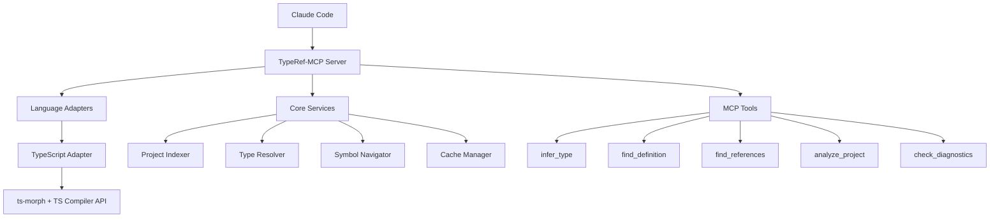

<div align="center">

# 🔍 TypeRef-MCP

**Professional TypeScript Type Inference & Symbol Navigation for Claude Code**

[](https://badge.fury.io/js/typeref-mcp)
[](https://www.npmjs.com/package/typeref-mcp)
[](https://opensource.org/licenses/MIT)
[](https://nodejs.org/)

*Bringing IDE-grade TypeScript intelligence to your AI coding assistant*

</div>

---

## ✨ Features

- 🎯 **Precise Type Inference**: Get exact TypeScript type information using the compiler API
- 🧭 **Symbol Navigation**: Find definitions, references, and usages with full type context
- 💡 **IntelliSense Intelligence**: Professional IDE-grade type analysis and suggestions
- ⚡ **Real-time Analysis**: Live type checking and diagnostics as you code
- 🏗️ **Extensible Architecture**: Designed to support multiple typed languages
- 🔄 **Hot Reload Support**: Watches for file changes and updates analysis automatically

## 🚀 Installation

> **Prerequisites**: Node.js 18+ required

### Option 1: NPM (Recommended)

```bash
# Global installation
npm install -g typeref-mcp

# Or with pnpm
pnpm add -g typeref-mcp

# Or with yarn
yarn global add typeref-mcp
```

### Option 2: From GitHub

```bash
# Install directly from GitHub
npm install -g github:Coldsewoo/typeref-mcp
```

### Option 3: From Source

```bash
# Clone and build
git clone https://github.com/Coldsewoo/typeref-mcp.git
cd typeref-mcp
npm install
npm run build
npm link
```

## 🔧 Configuration

### Claude Code Setup

Add TypeRef-MCP to your Claude Code MCP configuration:

```json
{
  "mcpServers": {
    "typeref": {
      "command": "typeref-mcp",
      "args": [],
      "env": {
        "NODE_ENV": "production"
      }
    }
  }
}
```

### Alternative Configurations

<details>
<summary><strong>Local Installation</strong></summary>

If installed locally in your project:

```json
{
  "mcpServers": {
    "typeref": {
      "command": "node",
      "args": ["./node_modules/.bin/typeref-mcp"],
      "env": {}
    }
  }
}
```

</details>

<details>
<summary><strong>Development Mode</strong></summary>

For development with hot reload:

```json
{
  "mcpServers": {
    "typeref": {
      "command": "typeref-mcp",
      "args": ["--watch"],
      "env": {
        "NODE_ENV": "development",
        "DEBUG": "typeref:*"
      }
    }
  }
}
```

</details>

<details>
<summary><strong>Custom TypeScript Config</strong></summary>

Specify a custom tsconfig.json:

```json
{
  "mcpServers": {
    "typeref": {
      "command": "typeref-mcp", 
      "args": ["--config", "./custom-tsconfig.json"],
      "env": {}
    }
  }
}
```

</details>

## 🛠️ Available Tools

TypeRef-MCP provides the following tools for Claude Code:

| Tool | Description | Usage |
|------|-------------|-------|
| `infer_type` | Get precise type information for any TypeScript expression | Analyze variable types, function signatures, complex expressions |
| `find_definition` | Navigate to symbol definitions with type context | Jump to function/class/interface definitions |
| `find_references` | Locate all usages of a symbol | Find where variables, functions, types are used |
| `analyze_project` | Get comprehensive project analysis | Overview of modules, exports, dependencies |
| `check_diagnostics` | Get real-time type checking errors | Identify compilation errors and warnings |

## 📖 Usage Examples

### Basic Type Inference

```typescript
// Ask Claude: "What's the type of this variable?"
const user = { name: "John", age: 30, active: true };

// TypeRef-MCP will return:
// Type: { name: string; age: number; active: boolean; }
```

### Advanced Type Analysis

```typescript  
// Complex generic types
function createStore<T extends Record<string, any>>(initial: T) {
  return {
    state: initial,
    update: (partial: Partial<T>) => ({ ...initial, ...partial })
  };
}

// TypeRef-MCP provides complete generic resolution and return types
```

### Symbol Navigation

```typescript
// Find all references to a function across your project
export function calculateTax(amount: number): number {
  return amount * 0.1;
}

// TypeRef-MCP will show all imports and usages with context
```

## 🏗️ Architecture

<div align="center">



</div>

## 🔧 Development

```bash
# Development mode with hot reload
npm run dev

# Watch mode for file changes
npm run watch

# Build for production
npm run build

# Code quality
npm run lint
npm run format

# Testing
npm test
npm run test:watch
```

## 🐛 Troubleshooting

<details>
<summary><strong>TypeRef-MCP not starting</strong></summary>

1. **Check Node.js version**: Ensure you're running Node.js 18+
   ```bash
   node --version
   ```

2. **Verify installation**: 
   ```bash
   npm list -g typeref-mcp
   ```

3. **Check TypeScript project**: Ensure your project has a valid `tsconfig.json`

</details>

<details>
<summary><strong>Type inference not working</strong></summary>

1. **Project indexing**: TypeRef-MCP needs to index your project first
2. **Large projects**: Initial analysis may take a few seconds
3. **TypeScript errors**: Fix compilation errors that might block analysis

</details>

<details>
<summary><strong>Performance issues</strong></summary>

1. **Large projects**: Consider excluding `node_modules` in your `tsconfig.json`
2. **Memory usage**: Restart the MCP server if memory usage grows too high
3. **Cache issues**: Clear TypeScript cache with `rm -rf .tsbuildinfo`

</details>

## 🤝 Contributing

We welcome contributions! Please see our [Contributing Guide](CONTRIBUTING.md) for details.

1. Fork the repository
2. Create a feature branch (`git checkout -b feature/amazing-feature`)
3. Commit your changes (`git commit -m 'Add amazing feature'`)
4. Push to the branch (`git push origin feature/amazing-feature`)
5. Open a Pull Request

## 📜 License

This project is licensed under the MIT License - see the [LICENSE](LICENSE) file for details.

---

<div align="center">

**Made with ❤️ by [Coldsewoo](https://github.com/Coldsewoo)**

*If you find TypeRef-MCP useful, please consider giving it a ⭐ on GitHub!*

</div>